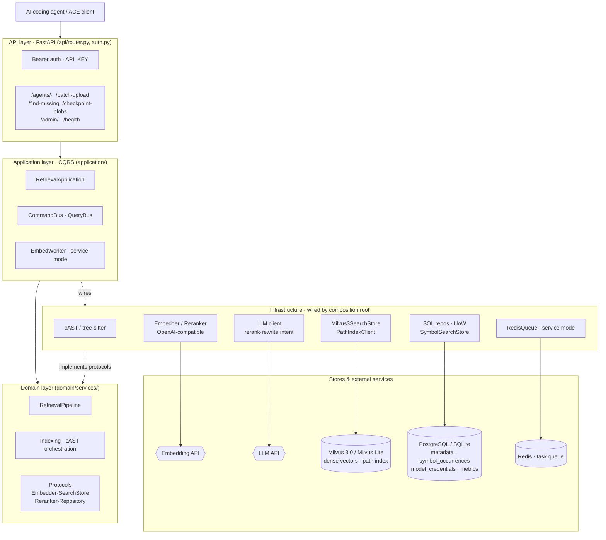
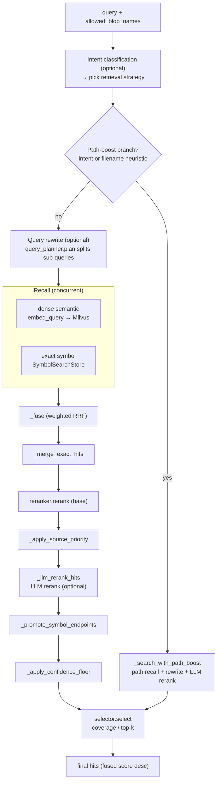

<div align="center">


# OpenContextEngine

**Self-hosted, ACE-compatible code retrieval for AI coding agents.**

Hybrid dense + exact + path recall · cAST-aware chunking · LLM reranking · coverage-aware selection

[English](README.md) · [简体中文](README.zh-CN.md)

[](https://github.com/oce-ai/oce/actions/workflows/ci.yml)
[](https://pypi.org/project/opencontextengine/)
[](https://pypi.org/project/opencontextengine/)
[](LICENSE)
[](https://github.com/oce-ai/oce/pkgs/container/oce)
[](https://fastapi.tiangolo.com/)
[](https://milvus.io/)
[](#api)

</div>

OpenContextEngine is a self-hosted, ACE-compatible code retrieval service. It indexes
source files with cAST-aware chunking, stores metadata in PostgreSQL or SQLite, performs
dense vector retrieval in Milvus 3.0, and reranks results with an LLM before
coverage-aware selection.

It ships two deployment modes: a zero-dependency **personal mode** (SQLite + embedded
Milvus Lite, background worker disabled) for a single machine, and a **service mode**
(PostgreSQL + Milvus 3.0 + Redis) for shared, higher-throughput deployments.

## Features

- **Hybrid retrieval** — concurrent dense semantic recall (Milvus 3.0), exact identifier lookup (`symbol_occurrences`), and an independent path index, fused with weighted rank fusion.
- **cAST-aware chunking** — tree-sitter parsing splits source along semantic boundaries instead of blind line windows.
- **LLM reranking + coverage-aware selection** — base rerank, optional LLM rerank, then greedy bin-packing that prioritizes repository coverage, suppresses overlapping spans, caps chunks per path, and respects a hard character budget.
- **Two deployment modes** — zero-dependency personal mode (SQLite + embedded Milvus Lite) for a single machine, or service mode (PostgreSQL + Milvus 3.0 + Redis) for shared, higher-throughput use.
- **ACE-compatible API** — a drop-in `/agents/*` surface for ACE clients, secured with bearer auth.
- **Clean DDD/CQRS architecture** — dependencies point inward; infrastructure is wired only by the composition root, keeping business logic testable.
- **Operational admin API + monitoring** — an admin-key-scoped surface manages model credentials, the embedding queue, and garbage collection, while a bypass metrics pipeline records call/token/resource stats and per-stage retrieval audits.
- **[Reproducible evaluation harness](https://github.com/oce-ai/oce-benchmark)** — an HTTP-only benchmark suite scores retrieval quality with Top-1 + nDCG@10 against real repositories.

<details>
<summary><strong>Table of contents</strong></summary>

- [Features](#features)
- [Requirements](#requirements)
- [Personal mode](#personal-mode)
- [Service mode](#service-mode)
- [API](#api)
- [Architecture](#architecture)
  - [Retrieval pipeline](#retrieval-pipeline)
- [Tests](#tests)
- [License](#license)

</details>

## Requirements

- Python 3.11 or newer
- [uv](https://docs.astral.sh/uv/)

Personal mode needs nothing else: metadata lives in SQLite and vectors in an embedded
Milvus Lite file. Service mode additionally requires PostgreSQL 16, Milvus 3.0, and
Redis; its development stack is defined in `docker-compose.dev.yml`.

## Personal mode

Install the CLI, generate a config, set the embedding key, and serve:

```powershell
uv tool install opencontextengine
oce init                    # writes ~/.oce/data/.env
# edit ~/.oce/data/.env: set EMBED_API_KEY (API_KEY is pre-filled for local use)
oce serve                   # http://127.0.0.1:8986
```

`oce serve` runs the database migrations (Alembic) on startup, then provisions SQLite,
the embedded Milvus Lite file, and a disabled background worker automatically, so
`oce init` only exposes the few keys you actually set. The generated `.env` lives in
the data directory and is loaded on every start. Useful flags:

- `--data-dir <path>` — where the database, vector file, and `.env` live (default `~/.oce/data`)
- `--env-file <path>` — load a specific `.env` instead (highest priority)
- `--port <n>` / `--host <addr>` — bind address (default `127.0.0.1:8986`)

`oce version` (or `oce --version`) prints the current version. `oce -v serve` raises the
log level to INFO and `-vv` to DEBUG; the default WARNING keeps retrieval-path info logs
quiet.

For a throwaway run without installing: `uvx --from opencontextengine oce serve`.

## Service mode

For shared deployments backed by PostgreSQL, Milvus 3.0, and Redis:

```powershell
uv sync --extra dev
Copy-Item .env.example .env
docker compose -f docker-compose.dev.yml up -d
uv run alembic upgrade head
uv run uvicorn oce.main:app --host 127.0.0.1 --port 8986
```

Model clients resolve credentials from the single `model_credentials` table by `kind`
(`embed`, `rerank`, `llm_rerank`, `query_rewrite`, `intent`): the active row with the
lowest `priority` number wins. When no active row matches a kind, that client falls back
to its environment variables (`EMBED_*`, `RERANK_*`, `LLM_*`; rerank also reuses the
embedding key). Manage these rows through the `/admin/credentials` API, then call
`POST /admin/credentials/reload` to hot-reload every client without restarting the service.

SiliconFlow accepts at most 32,000 characters across one embedding request's `input`
array. `max_batch_size` and `max_batch_chars` are provider defaults that each credential
may override. Inputs longer than `max_input_chars` are split at text boundaries with
overlap, embedded separately, then length-weighted, pooled, and normalized into one chunk
vector. This model-specific segmentation does not change domain chunk boundaries.

Repository-level requests containing multiple explicit sentences or list items are
decomposed into one complete query plus bounded facet queries. Each query recalls
candidates independently; results are fused with weighted rank fusion (configurable via
`RETRIEVAL_RRF_K`) before reranking. Single-query mode uses `RETRIEVAL_DEFAULT_TOP_K`;
multi-query mode uses `RETRIEVAL_PER_QUERY_TOP_K` per query to control candidate pool
size. Final selection applies a greedy bin-packing strategy that prioritizes repository
coverage (two-pass: first ensures each file has representation, second fills remaining
budget), suppresses overlapping spans within files, caps chunks per path, and respects a
hard character budget. Disable decomposition with `RETRIEVAL_QUERY_DECOMPOSITION_ENABLED=false`
to revert to classic single-query Top-K behavior.

Upload admission rejects dependency/build/cache directories, NUL-containing files, and
non-source artifacts such as SVG, media, archives, minified bundles, source maps, and lock
files before chunking. Skipped paths are persisted as empty ready blobs so clients do not
re-upload them indefinitely. Project manifests and test fixtures have explicit exemptions.

## API

Three auth tiers:

- **Public** (no auth) — `GET /health`, `GET /version`
- **Data plane** — `Authorization: Bearer <API_KEY>`
- **Admin** (`/admin/*`) — `Authorization: Bearer <ADMIN_API_KEY>`; when `ADMIN_API_KEY` is unset it falls back to `API_KEY`

Browser calls from the official admin panel (`https://oce-ai.github.io`) are allowed by
default; override the allowlist with `CORS_ORIGINS` (comma-separated) or set it empty to
disable CORS. The admin key lives only in the panel's browser storage — never commit it or
put it in a URL.

### Data-plane endpoints

| Method | Path | Purpose |
| --- | --- | --- |
| `POST` | `/find-missing` | Classify unknown and non-indexed blob hashes |
| `POST` | `/batch-upload` | Chunk, embed, and index source blobs |
| `POST` | `/agents/codebase-retrieval` | Return formatted code context |
| `POST` | `/agents/blob-status` | Reconcile blob and checkpoint state |
| `POST` | `/checkpoint-blobs` | Create or advance a working-set checkpoint |

### Admin endpoints

| Method | Path | Purpose |
| --- | --- | --- |
| `GET` | `/admin/credentials` | List model credentials (secrets masked) |
| `POST` | `/admin/credentials` | Create a credential |
| `PATCH` | `/admin/credentials/{id}` | Update a credential |
| `DELETE` | `/admin/credentials/{id}` | Delete a credential |
| `POST` | `/admin/credentials/{id}/duplicate` | Clone a credential with a new key |
| `POST` | `/admin/credentials/reload` | Hot-reload active credentials |
| `GET` | `/admin/queue` | Embedding queue depth and inflight count |
| `POST` | `/admin/queue/reset` | Drain or reset the embedding queue |
| `POST` | `/admin/queue/requeue-stale` | Requeue stale inflight blobs |
| `POST` | `/admin/gc` | Garbage-collect expired chains and blobs |
| `GET` | `/admin/stats` | Call / token / retrieval / resource metrics |

Example:

```powershell
$headers = @{ Authorization = "Bearer $env:API_KEY" }
$body = @{
  information_request = "Where is request authentication implemented?"
  # 全库检索已禁用：必须声明工作集（有效的 checkpoint_id 或非空 added_blobs）。
  # added_blobs 是 batch-upload 返回的 blob_name（sha256 内容地址），此处为示例占位。
  blobs = @{ checkpoint_id = ""; added_blobs = @("<blob-name-from-batch-upload>"); deleted_blobs = @() }
} | ConvertTo-Json -Depth 4
Invoke-RestMethod http://127.0.0.1:8986/agents/codebase-retrieval `
  -Method Post -Headers $headers -ContentType application/json -Body $body
```

## Architecture

Dependencies point inward (`shared <- domain <- application <- api`). `infrastructure`
implements domain/shared protocols and is wired only by the composition root
(`application/container.py`); routers never orchestrate business logic.



The application layer owns use-case orchestration and transaction boundaries. FastAPI only
validates transport DTOs, applies authentication, and maps errors. PostgreSQL (SQLite in
personal mode) stores blob/chunk/checkpoint metadata and identifier occurrences; Milvus
stores dense vectors and the path index.

### Retrieval pipeline

`RetrievalPipeline.search` (`domain/services/retrieval.py`) runs intent-aware stages:
optional classification and query rewrite, concurrent dense + exact recall, weighted rank
fusion, base rerank, optional LLM rerank, and coverage-aware final selection.



## Tests

Run focused files so Milvus Lite and tree-sitter runtimes are released between processes:

```powershell
uv run pytest tests/unit/application/test_service.py -q
uv run pytest tests/unit/domain/test_retrieval.py -q
uv run pytest tests/unit/infrastructure/test_milvus3.py -q
```

Do not invoke the entire `tests/unit/infrastructure` directory in one process on
memory-constrained development machines.

## License

Apache-2.0. OpenContextEngine is independent of Augment Code Inc.
