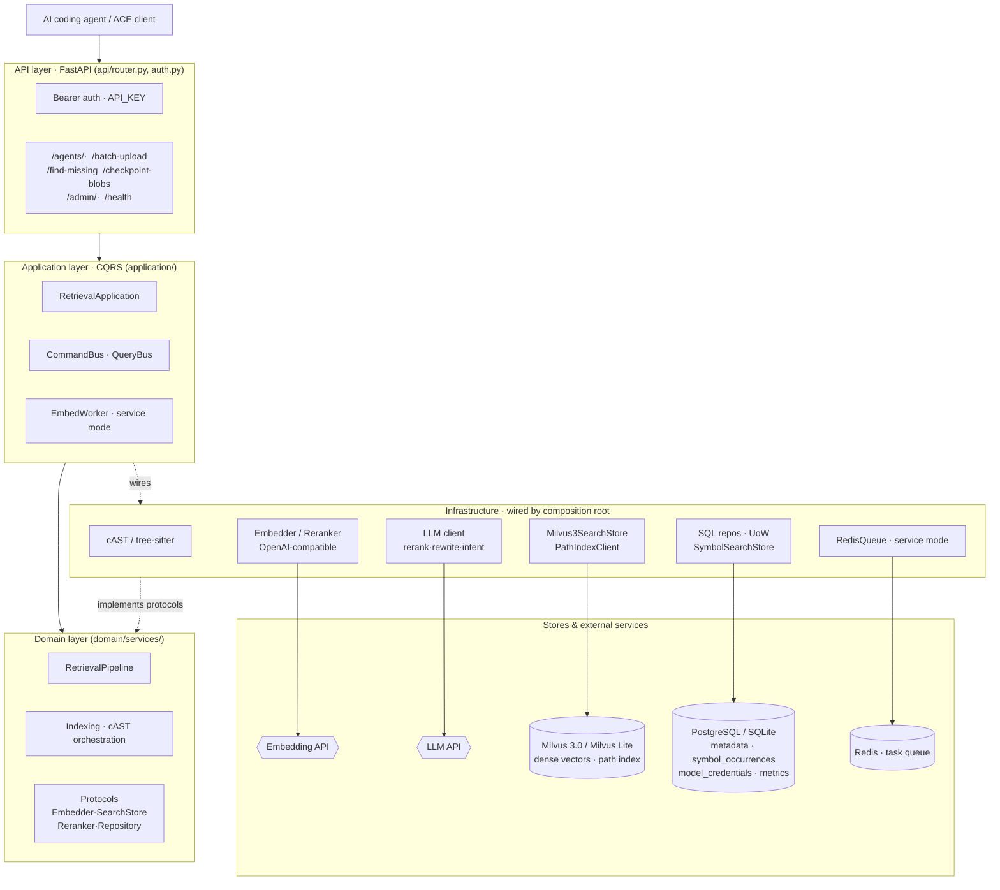
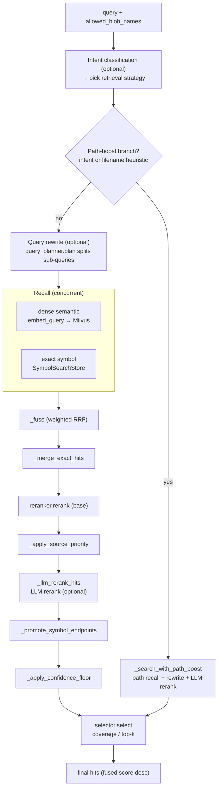

<div align="center">


# OpenContextEngine

**Self-hosted, ACE-compatible code retrieval for AI coding agents.**

[English](README.md) · [简体中文](README.zh-CN.md)

[](https://github.com/oce-ai/oce/actions/workflows/ci.yml)
[](https://pypi.org/project/opencontextengine/)
[](https://pypi.org/project/opencontextengine/)
[](LICENSE)
[](https://github.com/oce-ai/oce/pkgs/container/oce)
[](https://fastapi.tiangolo.com/)
[](https://milvus.io/)
[](#api)

</div>

OpenContextEngine (OCE) gives AI coding agents accurate, up-to-date context from your
codebase. It indexes source files with semantic (cAST) chunking, retrieves with hybrid
dense + exact + path recall, reranks with an LLM, and returns a coverage-aware selection —
all behind an ACE-compatible HTTP API you host yourself.

- **Server** (this repo): <https://github.com/oce-ai/oce>
- **Client**: <https://github.com/oce-ai/oce-client> — workspace sync, retrieval CLI, and MCP server

## Table of contents

- [Choosing a mode](#choosing-a-mode)
- [Quick start (personal mode)](#quick-start-personal-mode)
- [Connect your AI tool (client & MCP)](#connect-your-ai-tool-client--mcp)
- [Service mode](#service-mode)
- [Features](#features)
- [API](#api)
- [Architecture](#architecture)
- [Evaluation harness](#evaluation-harness)
- [Development](#development)
- [License](#license)

## Choosing a mode

OCE ships two deployment modes. Start with personal mode unless you know you need to
share one index across users or machines.

| | **Personal mode** | **Service mode** |
| --- | --- | --- |
| For | One machine, one user | Shared index, multiple users/machines |
| Storage | SQLite + embedded Milvus Lite | PostgreSQL 16 + Milvus 3.0 + Redis |
| External services | **None** | Provided by Docker Compose |
| Install | `uv tool install opencontextengine` | `docker compose up -d` |
| Background worker | Disabled (synchronous embedding) | Enabled (Redis queue) |

Both modes need one thing you provide: an **OpenAI-compatible embedding service** —
either a hosted provider key or a local inference server (e.g. llama-server).

## Quick start (personal mode)

Requires Python 3.11+ and [uv](https://docs.astral.sh/uv/). No database or vector store
to set up — everything lives in `~/.oce/data`.

**1. Install and initialize**

```powershell
uv tool install opencontextengine
oce init                    # writes ~/.oce/data/.env
```

**2. Configure the embedding service** in `~/.oce/data/.env`. The defaults point at a
local OpenAI-compatible server on `127.0.0.1:8994` (embedding + rerank); if you run one,
there is nothing to change. To use a hosted provider instead (SiliconFlow shown as an
example):

```dotenv
EMBED_API_KEY=your_embedding_service_key
EMBED_ENDPOINT=https://api.siliconflow.cn/v1/embeddings
EMBED_MODEL=Qwen/Qwen3-Embedding-4B
EMBED_DIMENSIONS=1024
RERANK_ENABLED=false        # keep true only if your provider offers a /rerank endpoint
```

**3. (Recommended) Configure a lightweight LLM.** Intent classification is on by default
and uses this client; any OpenAI-compatible, low-latency model works:

```dotenv
LLM_API_KEY=your_llm_service_key
LLM_BASE_URL=https://api.siliconflow.cn/v1
LLM_MODEL=Qwen/Qwen2.5-7B-Instruct
```

Without an LLM key, each query silently falls back to heuristic intent classification;
set `RETRIEVAL_INTENT_CLASSIFICATION_ENABLED=false` to skip the attempt entirely.
LLM reranking and query rewrite are off by default.

**4. Start the service**

```powershell
oce serve                   # http://127.0.0.1:8986
```

That's it. Migrations, SQLite, and the embedded Milvus Lite file are provisioned
automatically on startup. Next, [connect your AI tool](#connect-your-ai-tool-client--mcp).

<details>
<summary><strong>CLI flags, security note, and tips</strong></summary>

- `--data-dir <path>` — where the database, vector file, and `.env` live (default `~/.oce/data`)
- `--env-file <path>` — load a specific `.env` instead (highest priority)
- `--port <n>` / `--host <addr>` — bind address (default `127.0.0.1:8986`)
- `oce version` (or `oce --version`) prints the version; `-v` raises logs to INFO, `-vv` to DEBUG (default WARNING)
- Throwaway run without installing: `uvx --from opencontextengine oce serve`

Personal mode binds to `127.0.0.1` and pre-fills the client-compatible
`API_KEY=sk-opencontextengine`. If you expose the service on a LAN or the public
internet, replace it with a strong random key and set the same value in the client
as `OCE_API_KEY`.

</details>

## Connect your AI tool (client & MCP)

The client scans a local workspace, uploads changes, and retrieves code context from the
server. It is a separate package — see <https://github.com/oce-ai/oce-client>.

**CLI usage:**

```powershell
uv tool install opencontextengine-client

$env:OCE_API_URL = "http://127.0.0.1:8986"
$env:OCE_API_KEY = "sk-opencontextengine"  # use the server API_KEY in service mode
$env:OCE_WORKSPACE = (Get-Location).Path

oce-client sync
oce-client retrieve "Where is request authentication implemented?"
```

**MCP (for AI coding tools):** install the MCP extra and start the stdio server:

```powershell
uv tool install "opencontextengine-client[mcp]"
oce-client-mcp --workspace C:\path\to\workspace
```

`oce-client-mcp` builds the initial index in the background, watches the workspace, and
exposes `codebase-retrieval` as an MCP tool. Pass `--workspace` more than once for
multiple workspaces (tool calls must then include the matching `workspace_folder`).
`OCE_API_URL`, `OCE_API_KEY`, and `OCE_WORKSPACE`/`OCE_WORKSPACES` are the environment
variable equivalents. Keep credentials in environment variables or a secret manager, not
in the MCP configuration file.

## Service mode

For multiple users or machines sharing one index. Backed by PostgreSQL, Milvus 3.0, and
Redis — the repository's Docker Compose brings them all up:

```powershell
git clone https://github.com/oce-ai/oce.git
Set-Location oce
Copy-Item .env.example .env
# Edit .env: set API_KEY, ADMIN_API_KEY, and EMBED_API_KEY; add LLM_API_KEY as needed.
docker compose up -d
```

The application container runs database migrations on startup. In service mode, always
replace `API_KEY` and `ADMIN_API_KEY` with strong random values and set the
`POSTGRES_PASSWORD` / `REDIS_PASSWORD` used by Compose. Never commit real credentials.

**Prebuilt image** for your own Compose/Kubernetes: set the application image to
`ghcr.io/oce-ai/oce:latest` and provide `DB_URL`, `REDIS_URL`, and `MILVUS_ENDPOINT`.
The container listens on port `8986`.

<details>
<summary><strong>Development setup (dependencies in Docker, app on host)</strong></summary>

`docker-compose.dev.yml` starts only the dependencies, publishing PostgreSQL on `25432`,
Redis on `26379`, and Milvus on `19530`. Point `DB_URL` and `REDIS_URL` at those host
ports, then:

```powershell
uv sync --extra dev
uv run alembic upgrade head
uv run uvicorn oce.main:app --reload --port 8986
```

</details>

### Admin panel

Manage the running service from the official web panel at
<https://oce-ai.github.io/oce-admin>:

1. Set a dedicated `ADMIN_API_KEY` on the server (if unset, it falls back to `API_KEY`).
2. Enter the service URL and admin key in the panel.
3. Manage model credentials, the embedding queue, garbage collection, and monitoring
   metrics.

The admin key is stored only in the browser's local storage — never put it in a URL,
repository, or log. For a custom panel domain, allow its origin via `CORS_ORIGINS`.

### Model credentials

Model clients resolve credentials from the `model_credentials` table by `kind` (`embed`,
`rerank`, `llm_rerank`, `query_rewrite`, `intent`): the active row with the lowest
`priority` number wins. When no active row matches a kind, that client falls back to its
environment variables (`EMBED_*`, `RERANK_*`, `LLM_*`; rerank also reuses the embedding
key). Manage rows through the `/admin/credentials` API, then call
`POST /admin/credentials/reload` to hot-reload every client without a restart.

## Features

- **Hybrid retrieval** — concurrent dense semantic recall (Milvus 3.0), exact identifier lookup (`symbol_occurrences`), and an independent path index, fused with weighted rank fusion.
- **cAST-aware chunking** — tree-sitter parsing splits source along semantic boundaries instead of blind line windows.
- **LLM reranking + coverage-aware selection** — base rerank, optional LLM rerank, then greedy bin-packing that prioritizes repository coverage, suppresses overlapping spans, caps chunks per path, and respects a hard character budget.
- **Query decomposition** — multi-facet requests split into one complete query plus bounded facet queries, each recalled independently and fused before reranking.
- **ACE-compatible API** — a drop-in `/agents/*` surface for ACE clients, secured with bearer auth.
- **Two deployment modes** — zero-dependency personal mode, or PostgreSQL/Milvus/Redis service mode.
- **Operational admin API + monitoring** — admin-key-scoped credential/queue/GC management, plus a bypass metrics pipeline for call/token/resource stats and per-stage retrieval audits.
- **Reproducible evaluation harness** — built-in `oce bench` scores retrieval quality (Top-1 + nDCG@10) against real repositories; see [Evaluation harness](#evaluation-harness).
- **Clean DDD/CQRS architecture** — dependencies point inward; infrastructure is wired only by the composition root.

<details>
<summary><strong>Retrieval behavior details</strong></summary>

**Query decomposition.** Repository-level requests containing multiple explicit sentences
or list items are decomposed into one complete query plus bounded facet queries. Each
query recalls candidates independently; results are fused with weighted rank fusion
(`RETRIEVAL_RRF_K`) before reranking. Single-query mode uses `RETRIEVAL_DEFAULT_TOP_K`;
multi-query mode uses `RETRIEVAL_PER_QUERY_TOP_K` per query. Disable with
`RETRIEVAL_QUERY_DECOMPOSITION_ENABLED=false` to revert to classic single-query Top-K.

**Long-input embedding.** Inputs longer than `max_input_chars` are split at text
boundaries with overlap, embedded separately, then length-weighted, pooled, and
normalized into one chunk vector. `max_batch_size` and `max_batch_chars` are provider
defaults each credential may override (e.g. SiliconFlow caps one request's `input` array
at 32,000 characters). This model-specific segmentation never changes domain chunk
boundaries.

**Upload admission.** Dependency/build/cache directories, NUL-containing files, and
non-source artifacts (SVG, media, archives, minified bundles, source maps, lock files)
are rejected before chunking. Skipped paths are persisted as empty ready blobs so clients
do not re-upload them indefinitely. Project manifests and test fixtures have explicit
exemptions.

</details>

## API

Three auth tiers:

- **Public** (no auth) — `GET /health`, `GET /version`
- **Data plane** — `Authorization: Bearer <API_KEY>`
- **Admin** (`/admin/*`) — `Authorization: Bearer <ADMIN_API_KEY>`; falls back to `API_KEY` when unset

For the full endpoint reference, open the auto-generated interactive docs at
`http://127.0.0.1:8986/docs` on a running instance.

Browser calls from the official admin panel origin (`https://oce-ai.github.io`) are
allowed by default; override the allowlist with `CORS_ORIGINS` (comma-separated) or set
it empty to disable CORS.

## Architecture

Dependencies point inward (`shared <- domain <- application <- api`). `infrastructure`
implements domain/shared protocols and is wired only by the composition root
(`application/container.py`); routers never orchestrate business logic. The application
layer owns use-case orchestration and transaction boundaries; FastAPI only validates
DTOs, applies authentication, and maps errors.



### Retrieval pipeline

`RetrievalPipeline.search` (`domain/services/retrieval.py`) runs intent-aware stages:
optional classification and query rewrite, concurrent dense + exact recall, weighted rank
fusion, base rerank, optional LLM rerank, and coverage-aware final selection.



## Evaluation harness

`oce bench` scores retrieval quality against real repositories (Top-1 + nDCG@10, 2 points
per query) over HTTP. The core idea is **layered hot-tuning + index reuse**: parameter
changes are split into three cost tiers so the most expensive action happens only once.

| Tier | Parameters | Cost | Action |
|---|---|---|---|
| **L0** | query-time (top_k / rrf_k / path_boost / toggles / thresholds…) | **seconds**, no restart, no reindex | `reconfigure` / `sweep` |
| **L1** | chunking / vector-index (chunk_size / HNSW M, efConstruction) | minutes, re-embed | drop collection + reindex |
| **L2** | embedding model / dimensions / storage backend | full reset + restart + re-embed | swap profile and restart |

```bash
# Zero-dependency local profile (SQLite + Milvus Lite, synchronous embedding):
uv run oce bench serve --profile local --tag dev --port 8987    # terminal 1 (long-running)
uv run oce bench run   --base-url http://127.0.0.1:8987 --repo flask   # terminal 2

# Index once, sweep N L0 parameter sets (seconds per switch, no re-embedding):
uv run oce bench sweep   --base-url http://127.0.0.1:8987 --repo flask \
    --matrix bench/profiles/sweep_topk.example.toml --reuse-index
uv run oce bench compare --runs bench/runs --param retrieval.default_top_k
```

Each run writes `<run_id>.json` (single source of truth for `compare`) plus `<run_id>.md`
into `bench/runs/`; both render from the same `RunRecord`. Long-lived baselines are
promoted into the tracked `bench/runs/golden/` via `compare --promote <run_id>`.

Full guide (safety gates, datasets, profiles, secrets):
[`docs/evaluation-guide.md`](docs/evaluation-guide.md).

## Development

```powershell
uv sync --extra dev
uv run pytest -q
```

Project conventions and contributor constraints live in [AGENTS.md](AGENTS.md).

## License

Apache-2.0. OpenContextEngine is independent of Augment Code Inc.
