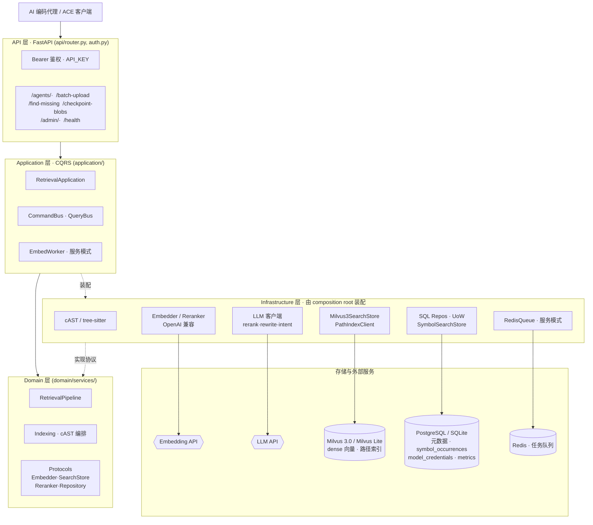
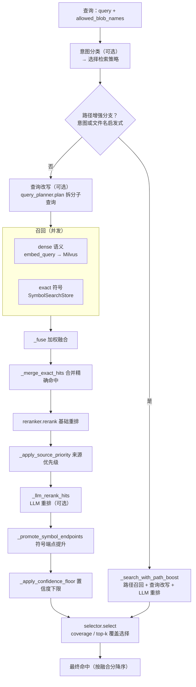

<div align="center">


# OpenContextEngine

**自托管、ACE 兼容的代码检索服务，为 AI 编码代理提供精准上下文。**

[English](README.md) · [简体中文](README.zh-CN.md)

[](https://github.com/oce-ai/oce/actions/workflows/ci.yml)
[](https://pypi.org/project/opencontextengine/)
[](https://pypi.org/project/opencontextengine/)
[](LICENSE)
[](https://github.com/oce-ai/oce/pkgs/container/oce)
[](https://fastapi.tiangolo.com/)
[](https://milvus.io/)
[](#api)

</div>

OpenContextEngine（OCE）让 AI 编码代理获取准确、实时的代码库上下文。它用 cAST 语义切块
索引源码，以 dense + exact + path 混合召回检索，经 LLM 重排后做覆盖度感知的最终选择——
全部封装在一套你自己托管的 ACE 兼容 HTTP API 之后。

- **服务端**（本仓库）：<https://github.com/oce-ai/oce>
- **客户端**：<https://github.com/oce-ai/oce-client> —— 工作区同步、检索 CLI 与 MCP server

## 目录

- [选择部署模式](#选择部署模式)
- [快速开始（个人模式）](#快速开始个人模式)
- [接入 AI 工具（客户端与 MCP）](#接入-ai-工具客户端与-mcp)
- [服务模式](#服务模式)
- [特性](#特性)
- [API](#api)
- [架构](#架构)
- [评测框架](#评测框架)
- [开发](#开发)
- [许可](#许可)

## 选择部署模式

OCE 提供两种部署模式。除非你明确需要多用户/多机器共享同一套索引，否则从个人模式开始。

| | **个人模式** | **服务模式** |
| --- | --- | --- |
| 面向 | 单机单用户 | 共享索引、多用户/多机器 |
| 存储 | SQLite + 内嵌 Milvus Lite | PostgreSQL 16 + Milvus 3.0 + Redis |
| 外部依赖 | **无** | 由 Docker Compose 提供 |
| 安装 | `uv tool install opencontextengine` | `docker compose up -d` |
| 后台 worker | 关闭（同步嵌入） | 开启（Redis 队列） |

两种模式都只需要你自备一样东西：一个 **OpenAI 兼容的嵌入服务**——托管供应商的 key，
或本地推理服务（如 llama-server）均可。

## 快速开始（个人模式）

需要 Python 3.11+ 和 [uv](https://docs.astral.sh/uv/)。无需部署任何数据库或向量库——
所有数据都在 `~/.oce/data`。

**1. 安装并初始化**

```powershell
uv tool install opencontextengine
oce init                    # 生成 ~/.oce/data/.env
```

**2. 配置嵌入服务** —— 编辑 `~/.oce/data/.env`。默认指向本地 `127.0.0.1:8994` 的
OpenAI 兼容服务（嵌入 + 重排），如果你跑了一个就无需改动。改用托管供应商时
（以 SiliconFlow 为例）：

```dotenv
EMBED_API_KEY=你的嵌入服务密钥
EMBED_ENDPOINT=https://api.siliconflow.cn/v1/embeddings
EMBED_MODEL=Qwen/Qwen3-Embedding-4B
EMBED_DIMENSIONS=1024
RERANK_ENABLED=false        # 供应商提供 /rerank 端点时才保持 true
```

**3.（推荐）配置一个轻量 LLM。** 意图分类默认开启且使用此客户端；任意 OpenAI 兼容的
低延迟模型均可：

```dotenv
LLM_API_KEY=你的 LLM 服务密钥
LLM_BASE_URL=https://api.siliconflow.cn/v1
LLM_MODEL=Qwen/Qwen2.5-7B-Instruct
```

不配置 LLM key 时，每次查询会静默回退到启发式意图分类；设
`RETRIEVAL_INTENT_CLASSIFICATION_ENABLED=false` 可完全跳过尝试。LLM 重排和查询改写
默认关闭。

**4. 启动服务**

```powershell
oce serve                   # http://127.0.0.1:8986
```

搞定。数据库迁移、SQLite 和内嵌 Milvus Lite 文件都会在启动时自动准备好。下一步：
[接入你的 AI 工具](#接入-ai-工具客户端与-mcp)。

<details>
<summary><strong>CLI 参数、安全提示与小技巧</strong></summary>

- `--data-dir <path>` —— 数据库、向量文件和 `.env` 的存放位置（默认 `~/.oce/data`）
- `--env-file <path>` —— 改为加载指定的 `.env`（优先级最高）
- `--port <n>` / `--host <addr>` —— 监听地址（默认 `127.0.0.1:8986`）
- `oce version`（或 `oce --version`）打印版本；`-v` 把日志提到 INFO，`-vv` 到 DEBUG（默认 WARNING）
- 不安装临时试跑：`uvx --from opencontextengine oce serve`

个人模式默认只监听 `127.0.0.1`，并预填客户端约定的 `API_KEY=sk-opencontextengine`。
如果要监听局域网或公网地址，请改用强随机 key，并在客户端同步设置 `OCE_API_KEY`。

</details>

## 接入 AI 工具（客户端与 MCP）

客户端负责扫描本地工作区、上传变更，并从服务端检索代码上下文。它是独立发布的包，
详见 <https://github.com/oce-ai/oce-client>。

**CLI 用法：**

```powershell
uv tool install opencontextengine-client

$env:OCE_API_URL = "http://127.0.0.1:8986"
$env:OCE_API_KEY = "sk-opencontextengine"  # 服务模式请改为服务端 API_KEY
$env:OCE_WORKSPACE = (Get-Location).Path

oce-client sync
oce-client retrieve "Where is request authentication implemented?"
```

**MCP（接入 AI 编码工具）**：安装 MCP extra 并启动 stdio server：

```powershell
uv tool install "opencontextengine-client[mcp]"
oce-client-mcp --workspace C:\path\to\workspace
```

`oce-client-mcp` 会在后台建立初始索引、监听工作区变化，并把 `codebase-retrieval` 暴露为
MCP 工具。多个工作区可重复传入 `--workspace`（此时工具调用必须指定对应的
`workspace_folder`）。`OCE_API_URL`、`OCE_API_KEY`、`OCE_WORKSPACE`/`OCE_WORKSPACES`
是等价的环境变量配置。请把密钥放在环境变量或 secret manager 中，不要写进 MCP 配置文件。

## 服务模式

面向多用户或多台机器共享同一套索引，由 PostgreSQL、Milvus 3.0 和 Redis 支撑——仓库自带的
Docker Compose 会把它们一起拉起：

```powershell
git clone https://github.com/oce-ai/oce.git
Set-Location oce
Copy-Item .env.example .env
# 编辑 .env：至少设置 API_KEY、ADMIN_API_KEY、EMBED_API_KEY；按需设置 LLM_API_KEY
docker compose up -d
```

应用容器启动时自动执行数据库迁移。服务模式务必把 `API_KEY` 和 `ADMIN_API_KEY` 换成强随机
值，并设置 Compose 使用的 `POSTGRES_PASSWORD` / `REDIS_PASSWORD`。不要把真实密钥提交到
仓库。

**预构建镜像**：在自己的 Compose/Kubernetes 中，将应用镜像设为
`ghcr.io/oce-ai/oce:latest`，并提供 `DB_URL`、`REDIS_URL` 和 `MILVUS_ENDPOINT`。
容器内监听 `8986` 端口。

<details>
<summary><strong>开发环境（依赖跑 Docker，应用跑宿主机）</strong></summary>

`docker-compose.dev.yml` 只启动依赖，PostgreSQL 映射到 `25432`、Redis 到 `26379`、
Milvus 到 `19530`。把 `DB_URL`、`REDIS_URL` 指向这些宿主机端口，然后：

```powershell
uv sync --extra dev
uv run alembic upgrade head
uv run uvicorn oce.main:app --reload --port 8986
```

</details>

### Admin 管理面板

服务启动后可用官方在线面板 <https://oce-ai.github.io/oce-admin> 管理运行中的服务：

1. 在服务端设置独立的 `ADMIN_API_KEY`（不设置时回落到 `API_KEY`）。
2. 在面板中填写服务地址和 admin key。
3. 管理模型凭据、嵌入队列、垃圾回收和监控指标。

admin key 只保存在浏览器本地存储中——不要写入 URL、仓库或日志。面板部署在自定义域名时，
用 `CORS_ORIGINS` 放行其来源。

### 模型凭据

模型客户端从 `model_credentials` 表按 `kind`（`embed`、`rerank`、`llm_rerank`、
`query_rewrite`、`intent`）解析凭据：取启用行中 `priority` 数字最小的一条。某个 kind 没有
匹配的启用行时，对应客户端回退到各自的环境变量（`EMBED_*`、`RERANK_*`、`LLM_*`；重排还会
复用嵌入 key）。通过 `/admin/credentials` API 管理这些行，再调
`POST /admin/credentials/reload` 即可不重启热重载所有客户端。

## 特性

- **混合检索** —— 并发的 dense 语义召回（Milvus 3.0）、exact 精确标识符查找（`symbol_occurrences`）与独立路径索引，用加权 rank fusion 融合。
- **cAST 语义切块** —— 基于 tree-sitter 沿语义边界切分源码，而非机械的行窗口。
- **LLM 重排 + 覆盖度感知选择** —— 基础重排、可选 LLM 重排，再用贪心 bin-packing 优先保证仓库覆盖度、抑制重叠片段、限制每路径 chunk 数，并遵守硬字符预算。
- **查询分解** —— 多面请求拆成一个完整查询加若干有界 facet 查询，各自独立召回后融合再重排。
- **ACE 兼容 API** —— 面向 ACE 客户端的 `/agents/*` 接口，Bearer 鉴权保护。
- **两种部署模式** —— 零依赖个人模式，或 PostgreSQL/Milvus/Redis 服务模式。
- **运维 admin API + 监控** —— admin key 独立鉴权的凭据/队列/GC 管理，加旁路 metrics 管线记录调用/token/资源指标与检索各阶段审计。
- **可复现的评测框架** —— 内置 `oce bench` 用 Top-1 + nDCG@10 在真实仓库上衡量检索质量，详见[评测框架](#评测框架)。
- **清晰的 DDD/CQRS 架构** —— 依赖向内收敛；infrastructure 只由 composition root 装配。

<details>
<summary><strong>检索行为细节</strong></summary>

**查询分解。** 包含多个明确句子或列表项的仓库级请求，会被分解成一个完整查询加若干有界
facet 查询。每个查询独立召回候选；结果用加权 rank fusion（`RETRIEVAL_RRF_K` 可调）融合后
再重排。单查询模式用 `RETRIEVAL_DEFAULT_TOP_K`，多查询模式每个查询用
`RETRIEVAL_PER_QUERY_TOP_K`。设 `RETRIEVAL_QUERY_DECOMPOSITION_ENABLED=false` 可关闭分解，
回到经典单查询 Top-K。

**长输入嵌入。** 超过 `max_input_chars` 的输入会在文本边界带重叠地切分、分别嵌入，再按
长度加权、池化并归一化成一个 chunk 向量。`max_batch_size` 和 `max_batch_chars` 是每个凭据
可覆盖的 provider 默认值（例如 SiliconFlow 单次请求 `input` 数组上限 32,000 字符）。这种
模型特定的分段不会改变领域层的 chunk 边界。

**上传准入。** 依赖/构建/缓存目录、含 NUL 的文件，以及 SVG、媒体、压缩包、压缩打包产物、
source map、lock 文件等非源码产物会在切块前被拒绝。被跳过的路径会作为空的 ready blob
持久化，避免客户端反复重传。项目清单和测试固件有显式豁免。

</details>

## API

鉴权分三档：

- **公开**（无需鉴权）—— `GET /health`、`GET /version`
- **数据面** —— `Authorization: Bearer <API_KEY>`
- **Admin**（`/admin/*`）—— `Authorization: Bearer <ADMIN_API_KEY>`；未配置时回落到 `API_KEY`

完整端点参考见运行实例上 FastAPI 自动生成的交互式文档：`http://127.0.0.1:8986/docs`。

后端默认已放行官方 admin 面板来源（`https://oce-ai.github.io`）；用 `CORS_ORIGINS`
覆盖白名单（多个来源用逗号分隔），或留空关闭浏览器跨域调用。

## 架构

依赖方向向内收敛（`shared <- domain <- application <- api`）。`infrastructure` 实现
domain/shared 协议，且只能由 composition root（`application/container.py`）装配；router
不编排业务流程。应用层负责用例编排和事务边界；FastAPI 只校验 DTO、执行鉴权和错误映射。



### 检索管线

`RetrievalPipeline.search`（`domain/services/retrieval.py`）按意图分阶段执行：可选的意图
分类与查询改写、并发的 dense + exact 召回、加权 rank fusion、基础重排与可选的 LLM 重排，
最后做覆盖度感知的选择。



## 评测框架

`oce bench` 用 Top-1 + nDCG@10（每题 2 分）在真实仓库上通过 HTTP 评估检索质量。核心理念
是**分层热调参 + 索引复用**：把改参数按代价分三层，让最贵的动作只发生一次。

| 层级 | 参数 | 代价 | 动作 |
|---|---|---|---|
| **L0** | 查询期（top_k / rrf_k / path_boost / 开关 / 阈值…） | **秒级**，不重启不重建索引 | `reconfigure` / `sweep` |
| **L1** | 切块 / 向量索引（chunk_size / HNSW M、efConstruction） | 分钟级，重嵌入 | drop collection + reindex |
| **L2** | 嵌入模型 / 维度 / 存储后端 | 完整 reset + 重启 + 重嵌入 | 切换 profile 并重启 |

```bash
# 零依赖本地 profile（SQLite + Milvus Lite，同步嵌入）：
uv run oce bench serve --profile local --tag dev --port 8987    # 终端 1（长驻）
uv run oce bench run   --base-url http://127.0.0.1:8987 --repo flask   # 终端 2

# 索引一次，扫 N 组 L0 参数（秒级切换，无需重嵌入）：
uv run oce bench sweep   --base-url http://127.0.0.1:8987 --repo flask \
    --matrix bench/profiles/sweep_topk.example.toml --reuse-index
uv run oce bench compare --runs bench/runs --param retrieval.default_top_k
```

每次 run 写 `<run_id>.json`（compare 的唯一真源）和 `<run_id>.md` 到 `bench/runs/`；
二者从同一份 `RunRecord` 渲染。长期保留的 baseline 用 `compare --promote <run_id>`
晋升进受追踪的 `bench/runs/golden/`。

完整指南（安全闸、数据集、profile、密钥）：
[`docs/evaluation-guide.md`](docs/evaluation-guide.md)。

## 开发

```powershell
uv sync --extra dev
uv run pytest -q
```

项目约定与贡献约束见 [AGENTS.md](AGENTS.md)。

## 许可

Apache-2.0。OpenContextEngine 与 Augment Code Inc. 相互独立。
