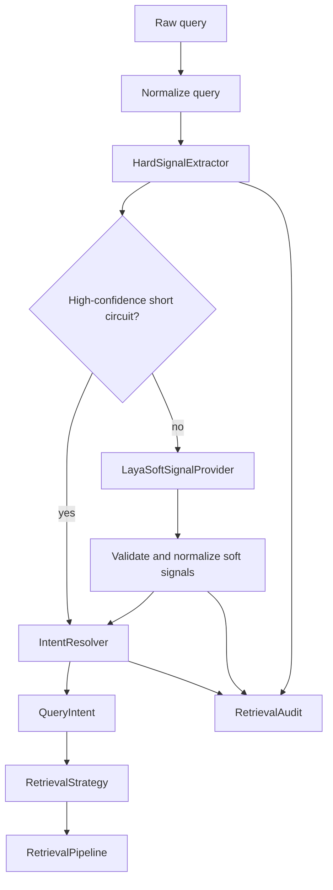
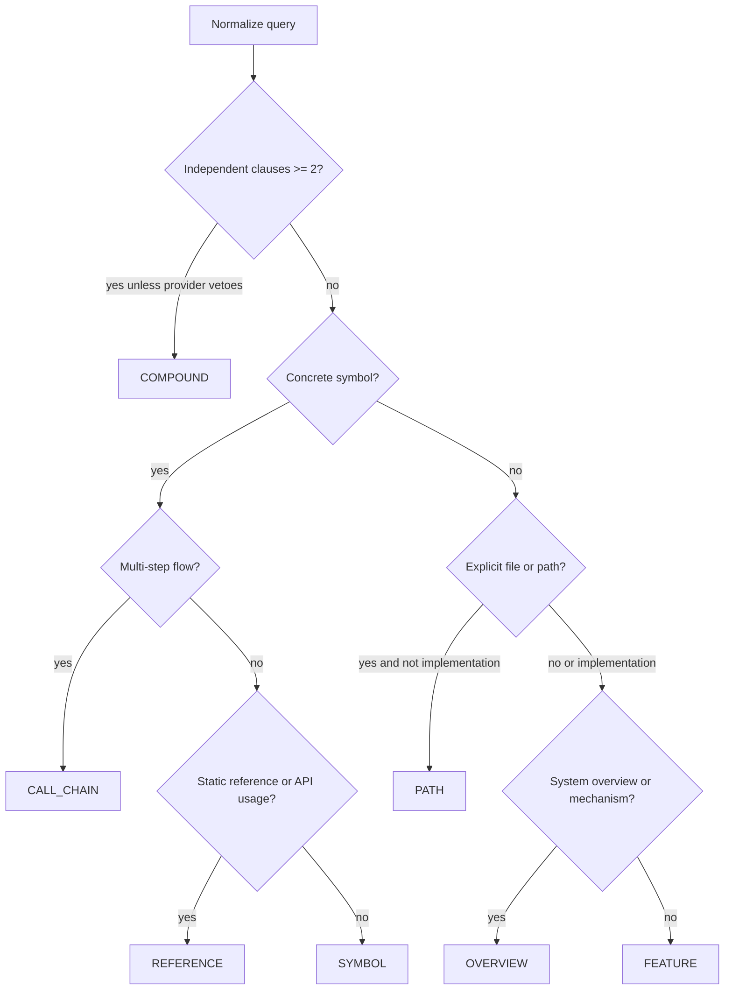

# OCE Hybrid Intent Classification 技术设计

状态：Implemented (shadow default)  
目标项目：`oce-ai/oce`  
适用范围：OCE code-search retrieval pipeline  
版本：`hybrid-v2`  
日期：2026-09-21

## 1. 摘要

OCE 当前把代码检索查询划分为七类：`S`（SYMBOL）、`C`（CALL_CHAIN）、`R`（REFERENCE）、`P`（PATH）、`F`（FEATURE）、`O`（OVERVIEW）和 `M`（COMPOUND）。现有实现同时包含确定性的启发式分类器和一个让 LLM 直接输出单个标签的分类器。

本设计建议把意图分类改为三段式 Hybrid Intent Classification：

```text
query
  ├── HardSignalExtractor
  │      └── 结构事实、符号、文件名、路径、子句数量
  │
  └── Laya soft signals
         └── 多个简单 noul 二分类问题
                 │
                 ▼
          Deterministic IntentResolver
                 │
                 ▼
             QueryIntent
                 │
                 ▼
           RetrievalStrategy
```

核心决策是：规则负责“已经可以从文本结构确定的事实”，Laya 只补充“需要语义理解的软信号”，最终的 `QueryIntent` 必须由 OCE 自己的 `IntentResolver` 产生。Laya 不直接拥有标签覆盖权，也不直接决定是否使用 path index、query rewrite 或 LLM rerank。

这个方案保留现有 `QueryIntent`、`RetrievalStrategy` 和检索审计接口，优先以兼容方式接入 `src/oce/domain/services/retrieval.py`。

## 2. 背景与目标

### 2.1 当前实现

当前仓库中与意图相关的主要入口如下：

| 位置 | 当前职责 |
|---|---|
| `src/oce/domain/services/query_classifier.py` | 基于正则和关键词的确定性分类，负责符号、文件名、路径和若干语义词的识别 |
| `src/oce/domain/services/llm/intent.py` | 调用 LLM，让模型直接输出一个 `S/C/R/P/F/O/M` 标签 |
| `src/oce/domain/services/llm/prompts.py` | 保存 7-way intent prompt |
| `src/oce/domain/services/retrieval.py` | 调用分类器、选择 `RetrievalStrategy`，并将结果写入 `RetrievalAudit.intent` |
| `src/oce/application/factories/retrieval.py` | 根据配置构造 intent LLM client 和 `IntentClassifier` |
| `src/oce/domain/services/retrieval_strategy.py` | 将 `QueryIntent` 映射为检索策略 |
| `src/oce/shared/config/settings.py` | 提供 `RETRIEVAL_INTENT_CLASSIFICATION_ENABLED` 等配置 |

启发式分类器已经明确实现了一个重要规则：出现具体符号时，符号优先于文件扩展名。例如 `` `invoke_handler` 在 lib.rs 中注册了哪些命令？`` 不应因为出现 `lib.rs` 就被路由为 `PATH`。本设计将这一规则提升为 Hybrid Resolver 的硬约束，而不是只依赖 prompt 提醒模型。

### 2.2 目标

本设计的目标是：

1. 保持 `QueryIntent` 七类输出和既有检索策略兼容。
2. 消除 flat 7-way LLM 分类中明显的 `P` 先验偏置。
3. 让符号、文件名、扩展名、路径和子句数量等结构事实由规则确定。
4. 让 Laya 只回答少量、边界清晰的语义问题。
5. 在 Laya 不可用、超时、返回格式错误或未配置凭据时，检索仍可由规则分类继续运行。
6. 将最终决策、短路原因、fallback 原因和耗时纳入 OCE 的现有审计与 benchmark 体系。
7. 为 intent classification 和 retrieval quality 建立可复现的 benchmark v2。

### 2.3 非目标

本阶段不做以下事情：

- 不改变 `QueryIntent` 的公开枚举值。
- 不让 Laya 直接生成检索结果或改写 `RetrievalStrategy`。
- 不把所有自然语言判断都硬编码成关键词。
- 不在没有 benchmark 证据的情况下删除现有 heuristic classifier。
- 不把 `REFERENCE` 和 `CALL_CHAIN` 合并为一个标签；二者仍由 resolver 按范围区分。

## 3. 现状与 benchmark 结论

### 3.1 7-way flat classification 结果

当前调研使用 84 条均衡样本，七个类别各 12 条。结果如下：

| 指标 | 结果 | 解释 |
|---|---:|---|
| Sample size | 84 | 7 类均衡样本 |
| Top-1 accuracy | 13.1%（11/84） | 直接选择最终标签的准确率 |
| Top-2 accuracy | 41.7% | 正确标签进入前两名的比例 |
| Top-3 accuracy | 65.5% | 正确标签进入前三名的比例 |
| `P` 选择次数 | 67/84（79.8%） | 明显的类别先验偏置 |
| `PATH` 已知分组准确率 | 9/12 | 是相对表现最好的分组，但仍存在符号/路径混淆 |
| `CALL_CHAIN` 已知分组准确率 | 0/12 | 流程语义没有稳定转化为最终标签 |
| `FEATURE` 已知分组准确率 | 0/12 | 功能实现与路径词高度混淆 |
| `OVERVIEW` 已知分组准确率 | 0/12 | 架构/机制语义容易被扁平标签先验覆盖 |
| `COMPOUND` 已知分组准确率 | 0/12 | 多目标结构没有得到稳定识别 |

已观测到的平均类别概率如下：

| Label | 平均概率 |
|---|---:|
| `S` | 0.057 |
| `C` | 0.139 |
| `R` | 0.146 |
| `P` | 0.341 |
| `F` | 0.065 |
| `O` | 0.103 |
| `M` | 0.151 |

在同一批 84 条样本上用全局平均概率做除法校准后，Top-1 accuracy 可以升到 35.7%。这个结果不能作为有效 benchmark，因为校准和测试使用了同一批数据，存在数据泄漏；它的价值在于证明模型并非完全没有捕捉语义，而是语义信号被 option/class bias 大幅淹没。

### 3.2 性能结果

同一轮测试的运行时表现稳定：

| 指标 | 结果 |
|---|---:|
| Server P50 | 13.6 ms |
| Server P95 | 18.7 ms |
| Wall P50 | 27.1 ms |
| Wall P95 | 36.0 ms |
| Errors | 0/84 |

结论是：当前主要问题不是 inference runtime、并发或可靠性，而是把一个带优先级和结构约束的决策树压成一次 flat choice 的任务建模方式。

### 3.3 失败模式

典型失败是：

```text
Show me the source of MyNamespace::CacheManager
```

模型会把 `source` 或 `where` 当成 location/path 语义，倾向输出 `P`，即使查询中已经存在具体代码符号。类似地，`` `SearchQueryHandler` 是在哪个 .py 文件定义的？`` 同时包含符号、文件扩展名和位置问法；如果由模型单独决定，文件名先验可能覆盖更重要的符号事实。

因此七类不是对称的普通分类标签，而更接近一棵有优先级的决策树：

```text
是否存在 concrete symbol
├── yes
│   ├── multi-step flow / trigger path → C
│   ├── how to call / use one symbol  → R
│   ├── definition / source lookup      → S
│   └── static reference lookup         → R (hybrid-v2; legacy prompt used S)
└── no
    ├── explicit file or path           → P
    ├── independent multiple requests  → M
    ├── architecture / mechanism       → O
    └── feature implementation         → F
```

## 4. Hybrid Intent Classification 架构

### 4.1 组件职责

| 组件 | 输入 | 输出 | 是否能直接决定最终 intent |
|---|---|---|---|
| `HardSignalExtractor` | 原始 query | `HardSignals` | 只能对硬约束负责 |
| `LayaSoftSignalProvider` | 原始 query 和可选硬信号摘要 | `SoftSignals` | 否 |
| `IntentResolver` | `HardSignals` + `SoftSignals` | `IntentDecision` | 是，唯一决策点 |
| `RetrievalStrategy` | `QueryIntent` | 检索阶段开关 | 否 |
| `RetrievalAudit` | 决策过程 | 阶段耗时和审计字段 | 否 |

### 4.2 数据流



### 4.3 核心原则

1. `HardSignals` 是事实，不是概率。例如是否出现反引号符号、是否有文件扩展名、是否有两个独立问句，都由 OCE 解析。
2. `SoftSignals` 是语义判断，不直接映射到 `QueryIntent`。每个信号都允许为 `true`、`false` 或 `unknown`，并携带可选置信度。
3. Resolver 必须是纯决策逻辑：同一组输入应产生同一输出，不依赖 Laya 的 option 顺序或全局类别先验。
4. Laya 异常只能影响软信号，不得使整个搜索请求失败。
5. 所有短路、fallback 和冲突都要有可观测的 `decision_reason`，但默认不记录原始 query，除非已有审计配置允许存储。

## 5. Hard rules 与 Laya soft signals 的职责边界

### 5.1 Hard rules

建议由 `HardSignalExtractor` 产出以下字段：

| 字段 | 类型 | 含义 | 典型来源 |
|---|---|---|---|
| `is_empty` | `bool` | query 是否为空或只有标点 | 规范化后的字符串 |
| `has_concrete_symbol` | `bool` | 是否存在可用于精确检索的具体符号 | backtick、snake_case、qualified identifier、类型名 |
| `symbol_tokens` | `tuple[str, ...]` | 提取出的符号列表 | 现有 `extract_code_identifiers` |
| `identifier_count` | `int` | 符号数量 | 符号提取器 |
| `has_filename` | `bool` | 是否出现带扩展名的文件名 token | `config.json`、`lib.rs` |
| `has_extension` | `bool` | 是否出现扩展名 | 文件名 token 解析 |
| `has_explicit_path` | `bool` | 是否出现相对/绝对路径或明确文件位置表达 | `/src/foo.py`、`src/foo.py`、`哪个文件` |
| `has_definition_marker` | `bool` | 是否询问定义、源码或实现位置 | `定义`、`source`、`where implemented` |
| `has_reference_marker` | `bool` | 是否询问静态使用/引用位置 | `在哪些文件中使用`、`references` |
| `has_flow_delimiter` | `bool` | 是否存在方向或多步骤边界 | `前端 → 后端`、`from X to Y` |
| `clause_count` | `int` | 可分割的独立请求数 | `and`、`以及`、多个问号或并列谓词 |
| `has_independent_clauses` | `bool` | 是否确实存在多个独立目标 | 子句解析器 |

规则拥有以下不可被 Laya 推翻的约束：

- `has_concrete_symbol=true` 时，最终不能因为文件名或扩展名而成为 `PATH`。
- `has_reference_marker=true` 且没有多步骤方向时，优先考虑 `REFERENCE`。
- `has_flow_delimiter=true` 且 query 绑定了具体符号时，至少进入 `CALL_CHAIN` 候选。
- 只有在没有具体符号，且查询确实是文件/路径定位时，`has_filename` 才能触发 `PATH`。
- `M` 只有在存在两个或以上独立请求时才允许成立；一个请求中的多个修饰词不算 `COMPOUND`。

### 5.2 Laya soft signals

Laya 不回答“七选一”，而回答几个边界更清晰的命题：

| 字段 | 含义 | 主要解决的边界 |
|---|---|---|
| `asks_call_chain` | 是否要求多步骤调用链、触发路径或端到端流程 | `C` vs `S/R` |
| `asks_api_usage` | 是否询问如何调用或使用一个具体 symbol/API | `R` vs `S` |
| `asks_overview` | 是否询问架构、机制、调度、状态管理或系统交互 | `O` vs `F` |
| `asks_compound` | 是否要求多个独立信息块 | `M` vs 单一 intent |
| `asks_implementation` | 是否询问一个功能或行为的实现位置/逻辑 | `F` vs `O/P` |

`REFERENCE` 的静态使用位置（例如“在哪些文件中被引用”）由 `has_reference_marker` 这一硬信号优先处理；`asks_api_usage` 专门表示“如何调用/如何使用”的单点使用语义。这样可以避免把 `R` 的含义继续交给一个宽泛的“usage”词匹配。

这条边界与冻结的旧 84 条 flat-prompt 回归集有意不同：旧 prompt 曾把
静态引用样本 S08/S09 标为 `S`。`hybrid-v2` 不再继承这个测试集约定，生产
resolver 将其判为 `R`；若需要复现旧回归分数，必须显式使用
`legacy_static_reference_as_symbol`/`--legacy-benchmark`，不能把该兼容开关带入
线上默认路径。

### 5.3 Soft signal contract

Laya adapter 对外应统一成与供应商无关的结构，示例：

```json
{
  "asks_call_chain": {"value": true, "confidence": 0.94},
  "asks_api_usage": {"value": false, "confidence": 0.91},
  "asks_overview": {"value": false, "confidence": 0.84},
  "asks_compound": {"value": false, "confidence": 0.97},
  "asks_implementation": {"value": true, "confidence": 0.72},
  "provider": "laya",
  "model": "<configured-model>",
  "latency_ms": 14.2
}
```

实际 Laya 返回格式由 `LayaSoftSignalProvider` 负责适配；domain 层不应依赖 Laya 的原始字段名。无法解析的字段统一为 `unknown`，不能默认为某个最终类别。

## 6. 推荐的 noul 问题设计

以下问题设计用于一次请求内并行执行多个 noul。每个问题只判断一个命题，避免把优先级、标签定义和最终决策混在一起。

```json
{
  "call_chain": {
    "type": "noul",
    "instructions": "Is the user asking for a multi-step call chain, trigger path, execution flow, or end-to-end flow across components? Return true only when multiple steps or boundaries must be connected."
  },
  "api_usage": {
    "type": "noul",
    "instructions": "Is the user asking how to call or use one concrete code symbol or API, without asking for a multi-step flow?"
  },
  "overview": {
    "type": "noul",
    "instructions": "Is the user asking about architecture, mechanism, scheduling, event handling, state management, or system-level interaction rather than one concrete symbol?"
  },
  "compound": {
    "type": "noul",
    "instructions": "Does the user request two or more independent pieces of information that would normally require separate retrieval goals? Do not mark true for modifiers of one goal."
  },
  "implementation": {
    "type": "noul",
    "instructions": "Is the user asking where or how a feature, behavior, or functional capability is implemented, without naming one concrete code symbol?"
  }
}
```

### 6.1 问题设计要求

- 不在 noul instructions 中出现 `S/C/R/P/F/O/M`，避免模型把多个问题重新压缩成一个标签选择。
- 每个问题都要定义正例和反例，并在 benchmark 中单独评估。
- `call_chain` 必须强调“多步骤/跨边界”，否则 `how is X used` 容易被误判为 `C`。
- `api_usage` 必须限定“一个具体 symbol/API”，否则泛化到功能说明后会污染 `F`。
- `overview` 只覆盖系统层级的架构、机制和状态，不把所有“how”都判为概览。
- `compound` 依赖规则提供的子句结构；Laya 只能补充语义，不凭 `and` 这个单词单独决定 `M`。
- `implementation` 用于无 concrete symbol 的功能描述；有 symbol 时由 resolver 按 `S/C/R` 分支处理。

### 6.2 建议的信号校验

Resolver 不直接信任概率，建议采用三态归一化：

```text
confidence >= intent_soft_min_confidence  -> true / false
confidence <  intent_soft_min_confidence  -> unknown
missing or malformed                       -> unknown
```

当同一请求出现 `asks_call_chain=true` 和 `asks_api_usage=true` 时，`call_chain` 优先，因为多步骤范围比单点使用更具体；当 `asks_overview=true` 和 `asks_implementation=true` 同时出现时，只有在 `has_concrete_symbol=false` 且存在系统级关键词时才选择 `OVERVIEW`，否则回落 `FEATURE`。

## 7. IntentResolver 决策树

### 7.1 决策优先级



这里的 `COMPOUND` 是查询形状判断，不是对单词数量的判断。若未来需要对复合查询的每个子句分别检索，可以在 `M` 之后增加子句级 resolver；本阶段仍返回一个兼容的 `QueryIntent.COMPOUND`。

### 7.2 Pseudocode

```python
def resolve_intent(
    query: str,
    hard: HardSignals,
    soft: SoftSignals,
) -> IntentDecision:
    """Resolve the final QueryIntent from hard facts and optional soft signals."""

    if hard.is_empty:
        return IntentDecision(
            intent=QueryIntent.FEATURE,
            reason="empty_or_unclassified_query",
            used_laya=soft.used_provider,
        )

    # Independent clauses are a hard boundary.  A provider may explicitly
    # veto a false positive, but it cannot erase two visible retrieval goals.
    if hard.has_independent_clauses and soft.asks_compound is not False:
        return IntentDecision(
            intent=QueryIntent.COMPOUND,
            reason="independent_clauses_confirmed",
            used_laya=soft.used_provider,
        )

    # Concrete symbols always outrank filenames and path words.
    if hard.has_concrete_symbol:
        if hard.has_flow_delimiter or soft.asks_call_chain is True:
            return IntentDecision(
                intent=QueryIntent.CALL_CHAIN,
                reason="symbol_with_multi_step_flow",
                used_laya=soft.used_provider,
            )

        if hard.has_reference_marker or soft.asks_api_usage is True:
            return IntentDecision(
                intent=QueryIntent.REFERENCE,
                reason="symbol_usage_or_reference_scope",
                used_laya=soft.used_provider,
            )

        return IntentDecision(
            intent=QueryIntent.SYMBOL,
            reason="concrete_symbol_default",
            used_laya=soft.used_provider,
        )

    # PATH is valid only for a path-shaped query without functional semantics.
    if (
        hard.has_explicit_path
        and not soft.asks_implementation is True
        and not soft.asks_overview is True
    ):
        return IntentDecision(
            intent=QueryIntent.PATH,
            reason="explicit_path_without_function_semantics",
            used_laya=soft.used_provider,
        )

    if hard.has_overview_marker or soft.asks_overview is True:
        return IntentDecision(
            intent=QueryIntent.OVERVIEW,
            reason="system_level_semantics",
            used_laya=soft.used_provider,
        )

    # A semantic compound signal is accepted only when the hard extractor also
    # found independent clauses; the provider cannot invent a broad search.
    if hard.has_independent_clauses and soft.asks_compound is True:
        return IntentDecision(
            intent=QueryIntent.COMPOUND,
            reason="provider_confirmed_independent_clauses",
            used_laya=soft.used_provider,
        )

    return IntentDecision(
        intent=QueryIntent.FEATURE,
        reason="feature_or_conservative_default",
        used_laya=soft.used_provider,
    )
```

`has_flow_delimiter`、`has_reference_marker` 和 `has_independent_clauses` 是硬事实；Laya 只能补充没有明确结构的语义。具体实现可以把 `IntentDecision` 扩展为包含 `hard_signals`、`soft_signals`、`fallback_reason` 和 `resolver_version` 的审计对象，但对外仍返回现有 `QueryIntent`。

### 7.3 关键样例

| Query | Hard signals | Soft signals | 结果 | 原因 |
|---|---|---|---|---|
| `Show me the source of MyNamespace::CacheManager` | `has_concrete_symbol=true` | `call_chain=false` | `SYMBOL` | symbol 优先，不能被 `source`/`where` 改成 `PATH` |
| `` `SearchQueryHandler` 是在哪个 .py 文件定义的？`` | symbol + filename | 无需 Laya | `SYMBOL` | 文件扩展名只是修饰信息 |
| `config.json 在哪里？` | filename + explicit path | 无 | `PATH` | 纯文件定位 |
| ``前端如何调用后端的 `add_provider` 命令？`` | symbol + flow | `asks_call_chain=true` | `CALL_CHAIN` | 跨边界调用链 |
| ``如何使用 `get_providers` API？`` | symbol | `asks_api_usage=true` | `REFERENCE` | 单点 API usage |
| `应用初始化状态管理的机制在哪里？` | no symbol | `asks_overview=true` | `OVERVIEW` | 系统级机制 |
| `自动启动功能的实现代码在哪里？` | no symbol | `asks_implementation=true` | `FEATURE` | 功能实现定位 |
| `找出配置文件，并说明启动时如何加载它` | independent clauses | `asks_compound=true` | `COMPOUND` | 两个独立检索目标 |

## 8. 短路策略

短路的目标是减少无必要的 Laya 调用，同时让高置信度结构查询更稳定。

### 8.1 不调用 Laya 的场景

建议直接由规则返回的场景：

1. 空 query 或规范化后无有效内容：返回 `FEATURE`，记录 `empty_or_unclassified_query`。
2. 有 concrete symbol，且存在明确的定义/源码/静态引用标记：返回 `SYMBOL` 或 `REFERENCE`。
3. 无 symbol、带明确文件名/路径，且没有功能或架构语义：返回 `PATH`。
4. 已命中本地 intent cache，且 cache entry 的 `resolver_version` 与当前配置一致。
5. shadow benchmark 明确要求只运行规则基线时。

### 8.2 需要调用 Laya 的场景

只在以下不确定边界调用一次 Laya，并在一次请求中并行执行五个 noul：

- concrete symbol 同时出现 `how/use/call`，需要区分 `CALL_CHAIN` 和 `REFERENCE`。
- 无 concrete symbol，但 `OVERVIEW`、`FEATURE`、`PATH` 的语义重叠。
- 规则检测到多个候选子句，但不能确认是否是多个独立目标。
- benchmark 要求采集 soft signal 以分析 resolver 决策。

### 8.3 缓存

cache key 建议为：

```text
sha256(normalized_query + resolver_version + prompt_version + model)
```

缓存只存结构化 soft signals 和决策元数据，不存 API key、原始凭据或未脱敏的供应商响应。默认使用进程内 bounded LRU；若未来需要跨进程共享，再引入显式的 cache backend。

## 9. Fallback 策略

Fallback 必须是可预测的，并且不能破坏检索主链路：

```text
HybridIntentClassifier
  ├── hard short circuit       -> IntentResolver
  ├── Laya success             -> IntentResolver(hard + soft)
  ├── timeout / transport err  -> IntentResolver(hard + unknown soft)
  ├── malformed response       -> IntentResolver(hard + unknown soft)
  └── classifier disabled      -> existing heuristic classifier
```

具体规则如下：

- Laya 超时、限流、无凭据或返回不可解析时，`soft` 全部置为 `unknown`，不把异常映射为 `PATH` 或其他任意标签。
- 规则层仍按现有 `classify_query_intent()` 逻辑工作，保证没有 LLM 时的行为可用。
- 如果 heuristic 也无法产生更具体结论，最终默认 `FEATURE`，保持当前兼容语义。
- `RetrievalPipeline.search()` 不应因为 intent LLM 失败抛出错误；现有的异常保护应继续保留，但异常日志应改为结构化字段，避免把原始 query 或凭据写入日志。
- `RetrievalAudit.intent` 继续写最终 `QueryIntent.value`；另外建议增加 `intent_source`（`hard`、`hybrid`、`heuristic`、`fallback`）和 `intent_decision_reason`。

## 10. 指标与 benchmark v2

### 10.1 线上/运行时指标

建议新增或补充以下指标：

| 指标 | 目的 |
|---|---|
| `intent_requests_total` | 意图分类总请求数 |
| `intent_laya_calls_total` | 实际调用 Laya 的次数，观察短路率 |
| `intent_short_circuit_ratio` | 规则直接决策比例 |
| `intent_fallback_total{reason}` | timeout、transport、malformed、disabled 等 fallback 原因 |
| `intent_latency_ms` | intent stage 的 P50/P95/P99 |
| `intent_laya_latency_ms` | Laya 子调用耗时 |
| `intent_error_rate` | Laya 或 adapter 错误率 |
| `intent_conflict_total{kind}` | 规则和 soft signal 冲突次数 |
| `intent_by_label_total{label}` | 最终标签分布，监测新的先验偏置 |
| `intent_cache_hit_ratio` | 缓存有效性 |
| `intent_tokens_total` | intent 模型消耗，沿用现有 token usage 旁路采集 |

默认不记录完整 query。需要离线分析时，使用已有的审计开关或稳定 hash，并明确数据保留策略。

### 10.2 分类质量指标

benchmark v2 至少应报告：

- overall accuracy、macro accuracy、macro/micro `F1`。
- 每个 label 的 precision、recall、F1 和 support。
- confusion matrix，重点观察 `S↔P`、`S↔R`、`C↔R`、`F↔O`、`F↔M`。
- symbol/path conflict accuracy：含 symbol + extension 的样本被判为 `PATH` 的比例应接近零。
- compound exact match 和 compound false-positive rate。
- short-circuit ratio、Laya invocation ratio、fallback ratio。
- soft signal calibration：confidence bucket、Brier score 或 ECE。
- P50/P95/P99 latency、error rate 和 token cost。

### 10.3 检索质量指标

分类改动最终服务于检索质量，必须和现有 OCE benchmark 一起看：

- `Top-1`。
- `nDCG@10`。
- `path_boosted` 命中率和路径类查询的单独分数。
- 各意图下的 Top-1/nDCG，特别是 `CALL_CHAIN`、`OVERVIEW`、`COMPOUND`。
- 与 baseline 相比的每题 delta，而不是只看总平均。

这些指标应复用 `src/oce/bench/scoring.py` 和现有 RunRecord/report 流程，避免另起一套不可比较的评分逻辑。

### 10.4 benchmark v2 计划

建议新增独立的 intent dataset，并保留当前 84 条作为 regression set：

1. **Core set**：七类各至少 20 条，合计 140 条，保持标签均衡。
2. **Boundary set**：覆盖 `symbol + extension`、`source vs path`、`usage vs call_chain`、`feature vs overview`、`compound vs modifier` 等最容易混淆的边界。
3. **Language set**：中文、英文、中英混合、代码符号和不同标点形式。
4. **Repository set**：至少覆盖 Flask、CC-Switch 以及一个结构不同的 Python/TypeScript/Rust 项目，避免只对单一仓库关键词过拟合。
5. **Regression set**：原 84 条冻结，不再用来调 prompt 或阈值。

建议按 query family 而不是随机行切分 dev/test，避免同一模板的轻微改写同时出现在两侧。每条样本应记录：

```json
{
  "id": "intent-v2-001",
  "query": "Where is `SearchQueryHandler` defined?",
  "gold_intent": "symbol",
  "has_concrete_symbol": true,
  "has_filename": false,
  "boundary_tags": ["symbol_location"],
  "language": "en",
  "repository": "oce"
}
```

### 10.5 Ablation matrix

benchmark v2 至少比较以下四组：

| Variant | Hard rules | Laya | Resolver | 目的 |
|---|---|---|---|---|
| `heuristic` | yes | no | heuristic | 当前稳定基线 |
| `flat_laya_7way` | no | yes | model top-1 | 复现现状失败结果 |
| `hybrid_rules_only` | yes | no | deterministic resolver | 衡量规则本身上限 |
| `hybrid_rules_laya` | yes | yes | deterministic resolver | 目标方案 |

每个 variant 同时跑 intent metrics 和 retrieval metrics。`global prior correction` 只能作为诊断项，不能作为正式 baseline，除非使用独立 calibration split。

### 10.6 建议验收门槛

以下是发布前目标，不是当前已达到的结果：

- `hybrid_rules_laya` 的 macro-F1 明显高于 `flat_laya_7way`，并且 `S↔P` 冲突错误率低于 1%。
- `CALL_CHAIN`、`OVERVIEW`、`COMPOUND` 不再出现整组接近零的 recall。
- 相比 heuristic baseline，retrieval `Top-1` 和 `nDCG@10` 不出现统计显著回退。
- intent stage P95 增量保持在可接受预算内；建议先以 50 ms 作为本地默认目标，线上按实际模型和部署环境调整。
- Laya 不可用时，fallback 请求成功率维持 100%，且不改变 API 错误语义。

## 11. 集成到 OCE 的模块边界

### 11.1 推荐改造边界

| 文件/目录 | 设计后的职责 | 变更策略 |
|---|---|---|
| `src/oce/domain/services/query_classifier.py` | 提供 `HardSignals` 和确定性提取函数；保留兼容 helper | 将现有正则逻辑抽成可复用 signal extractor，不立即删除旧函数 |
| `src/oce/domain/services/intent_resolver.py` | 新增纯函数/领域服务 `IntentResolver`、`SoftSignals`、`IntentDecision` | 不依赖 Laya client、不访问配置或数据库 |
| `src/oce/domain/services/llm/intent.py` | 实现 `LayaSoftSignalProvider`；负责 prompt 调用、响应解析和三态归一化 | 保留 legacy 7-way adapter 以便回归和 A/B |
| `src/oce/domain/services/llm/prompts.py` | 保存 noul prompt、版本常量和 examples | 将 prompt 版本化，例如 `INTENT_SOFT_PROMPT_V1` |
| `src/oce/domain/services/retrieval.py` | 注入 hybrid classifier，使用最终 `QueryIntent` 选择策略 | 保持 `RetrievalPipeline` 的异常保护和 audit 语义 |
| `src/oce/application/factories/retrieval.py` | 根据 mode 构造 heuristic、legacy 或 hybrid classifier | composition root 负责组装，router 不编排 |
| `src/oce/shared/config/settings.py` | 增加 hybrid mode、timeout、threshold、cache 和 shadow 配置 | 配置字段使用 `RETRIEVAL_` 前缀 |
| `src/oce/application/commands/reconfigure.py` | 明确哪些 intent 参数可热改 | 继续采用重建 + 原子重注册，不原地修改 pipeline |
| `src/oce/shared/metrics.py` 与 `src/oce/infrastructure/metrics/` | 记录来源、原因、soft signal 和阶段耗时 | 监控旁路失败不能阻塞检索主链路 |
| `tests/unit/domain/` | resolver、hard signal、边界样本单元测试 | 先测纯逻辑，再测 adapter/fallback |
| `bench/datasets/` 与 `src/oce/bench/` | 保存 intent v2 数据集并将分类结果纳入报告 | 复用现有 RunRecord 和 report 渲染体系 |

### 11.2 对现有代码的兼容要求

- 保留 `src/oce/domain/services/llm/intent.py` 中 legacy `IntentClassifier` 的可构造路径，至少到 benchmark v2 完成。
- `RetrievalPipeline` 继续接受一个 `classify(query) -> QueryIntent` 兼容接口，减少对现有测试 fake 的破坏。
- `get_strategy()` 只接收最终 `QueryIntent`，不感知硬信号和 Laya。
- `should_use_path_index()` 应使用 resolver 的最终结果或其硬信号快照，不能再单独运行一套可能与主分类冲突的规则。
- `RetrievalAudit.intent` 继续使用现有字符串值；新字段应向后兼容数据库读取和旧报告。
- 凭据仍使用现有 `model_credentials.kind = "intent"` 解析链，不在 query 或 URL 中传递 API key。

## 12. 配置建议

以下字段已写入 `RetrievalSettings`，名称遵循当前 `RETRIEVAL_` 前缀；保留这段配置块作为部署示例。

```env
# Existing switch
RETRIEVAL_INTENT_CLASSIFICATION_ENABLED=true

# Hybrid controls
# Safe rollout default: keep heuristic as the main path and observe hybrid.
# Switch to hybrid explicitly only after an independent held-out evaluation.
RETRIEVAL_INTENT_MODE=shadow
# 默认 false：规则 resolver 不产生外部调用；确认费用和端点后再显式打开
RETRIEVAL_INTENT_SOFT_SIGNALS_ENABLED=false
RETRIEVAL_INTENT_SOFT_TIMEOUT_MS=50
RETRIEVAL_INTENT_SOFT_MIN_CONFIDENCE=0.60
RETRIEVAL_INTENT_CACHE_SIZE=1024
RETRIEVAL_INTENT_RESOLVER_VERSION=hybrid-v2
RETRIEVAL_INTENT_PROMPT_VERSION=soft-v1
```

建议的 mode 语义：

| `RETRIEVAL_INTENT_MODE` | 行为 |
|---|---|
| `heuristic` | 只运行现有确定性分类，作为低成本 baseline |
| `legacy_7way` | 运行现有单标签 LLM 分类，用于复现和对比 |
| `hybrid` | 规则短路 + Laya soft signals + deterministic resolver（显式 opt-in） |
| `shadow` | 主链路使用 heuristic，旁路运行 hybrid 供对照（不改变主链路） |

上线建议：默认 `shadow` 观察冲突和延迟，再在 benchmark profile 或部署环境中显式
开启 `hybrid`；不要在没有独立留出集结果时直接改变所有部署的默认 mode。
`bench/profiles/local.toml` 当前将 `intent_classification_enabled` 设为 `false`，
benchmark v2 应通过独立 profile 显式开启，避免改变现有本地零依赖评测的含义。

## 13. 实施计划

### Phase 0：冻结基线

- 将当前 84 条样本、flat 7-way prompt、性能结果和报告归档。
- 为每条样本补充 hard signal 标注和 boundary tags。
- 固定 `heuristic` 与 `legacy_7way` 的输出，避免后续改动污染基线。

### Phase 1：纯规则 resolver

- 抽出 `HardSignals`。
- 新增 `IntentResolver`，先不接 Laya。
- 保持旧 API 和旧测试通过。
- 加入 symbol/path、usage/call-chain、feature/overview、compound 边界测试。

### Phase 2：Laya shadow

- 实现五个 noul 的 adapter 和结构化解析。
- `shadow` 模式下记录 soft signals、最终 resolver 结果和 legacy/heuristic 差异。
- 验证 timeout、malformed response、no credential、cache 和 retry 行为。

### Phase 3：Hybrid benchmark

- 运行 benchmark v2 的四组 ablation。
- 同时比较 intent metrics、retrieval Top-1/nDCG、延迟和 token cost。
- 只在独立 calibration split 上选择阈值，禁止用 regression/test set 调参。

### Phase 4：逐步启用

- 先对 benchmark profile 开启 `hybrid`。
- 观察线上 fallback、冲突和 P95。
- 达到验收门槛后再考虑将 hybrid 设为默认，并保留 `legacy_7way` 作为回滚开关。

## 14. 风险与后续迭代

| 风险 | 影响 | 缓解措施 |
|---|---|---|
| Laya soft signal 仍有类别/问题偏置 | resolver 输入被污染 | 不让模型直接选标签；监测每个 noul 的正例率和 calibration |
| 规则误识别普通词为 symbol | 错误进入 `S/C/R` | 保留 concrete symbol 的多重条件，补充跨语言负例 |
| 中文、英文和混合 query 语义不对称 | 某语言 recall 下降 | benchmark v2 分语言报告，prompt 提供双语正反例 |
| `source`、`where`、`how` 等词多义 | `S/P/F` 混淆 | 结构信号优先，语义词只作为 soft hint |
| compound 判断过于激进 | 过多返回 `M`，检索策略变宽 | 只接受结构上独立的检索目标；provider 可否决误报，不能凭空制造 `M` |
| Laya 延迟或不可用 | 请求变慢或分类降级 | 高置信度短路、timeout、cache、heuristic fallback |
| prompt/model 变更导致结果漂移 | benchmark 不可比较 | 记录 `model`、`prompt_version`、`resolver_version` |
| 记录原始 query 带来隐私风险 | 审计数据泄漏 | 默认只记录 hash 和结构化信号，遵循现有 audit 开关 |
| 新参数热改造成 pipeline 状态不一致 | 线上行为撕裂 | 遵循现有 reconfigure 的重建 + 原子重注册策略 |

后续可以考虑：

- 对 compound query 做 clause-level retrieval，而不是只返回一个 `COMPOUND` 策略。
- 引入显式 `unknown/abstain` 供离线评测使用，但对 ACE/OCE 外部契约仍映射到兼容 intent。
- 使用独立 calibration set 学习各 noul 的阈值，而不是共享一个 `0.60`。
- 将 hard signal extractor 的结果复用于 exact search、path search 和 rerank prompt，避免同一 query 被多次解析。
- 研究把 intent 结果和 retrieval feedback 联动，但必须保持 resolver 的可解释性和可回滚性。

## 15. 结论

84 条 benchmark 的结果已经足够说明：Laya 运行很快，但直接让它在七个有重叠、带优先级的标签中做一次选择并不可靠。OCE 应把 intent classification 重新定义为“结构事实提取 + 少量语义信号 + 确定性决策”。

在这个架构中：

- `S/C/R/P/F/O/M` 仍是 OCE 的业务分类，不交给模型自由改写。
- symbol 优先于 path 是代码级不变量。
- Laya 的价值从“替 OCE 做最终判断”变成“补充 OCE 不容易用规则判断的语义”。
- resolver、fallback、指标和 benchmark 都可以独立测试、回滚和演进。

这使得 intent 质量提升可以直接服务于现有 `RetrievalStrategy`，同时不把检索主链路的稳定性绑定到某一次 Laya 调用或某个模型的类别先验上。

## 16. 当前实现状态（2026-09-22）

本设计已经落到 OCE 主链路，而不只是停留在方案层：

- `query_classifier.py` 提供 `HardSignals` / `HardSignalExtractor`，并对符号、文件名、路径、调用链、API usage 和独立子句做结构提取。
- `intent_resolver.py` 提供纯函数 `resolve_intent()`、`IntentResolver`、三态 `SoftSignals` 和可审计的 `IntentDecision`。最终标签仍由 resolver 产生。
- `llm/intent.py` 保留旧的 `IntentClassifier`，新增 `LayaSoftSignalProvider`、`HybridIntentClassifier`、`HeuristicIntentClassifier` 与 `ShadowIntentClassifier`。soft provider 只返回五个命题的 JSON，不返回七分类标签；解析失败、超时和无凭据均降级为 unknown/fallback。
- `RetrievalSettings` 增加 `intent_mode`、soft timeout/confidence、LRU cache 和 resolver/prompt version；`retrieval` 工厂按模式组装。默认 `intent_mode=shadow`，因此 rules-only hybrid 不会未经显式配置接管主链；`heuristic` 与 rules-only hybrid 均不构造 LLM client。soft provider 默认关闭，检测到旧 Alibaba/DashScope 端点时也会 fail-closed。
- `RetrievalAudit` 额外记录 `intent_source` 与 `intent_decision_reason`，不改变旧的 `intent` 字段语义。
- 所有 OCE outbound model clients（chat、rerank、embedding）在网络边界拦截 DashScope/Alibaba/Qianwen host；即使数据库凭证覆盖了 `.env`，也不会发出请求。

冻结的 84 条回归集（来自 `D:\laya-windows-x86_64-cuda-sm89\typesafe_jev_intent_benchmark.py`）
只有在显式 `--legacy-benchmark` 兼容模式下才保持原来的 84/84；其中 S08/S09
把静态引用约定为 `S`，不能作为 hybrid-v2 的独立质量证据。生产 rules-only
resolver 使用 hybrid-v2（静态引用为 `R`），其结果必须在未参与调参的独立留出集
上报告。旧的 `oce-laya/checkpoints/oce-laya-best` 仍保留作历史回归对照，但它的
91.67% 只来自冻结 84 条回归集，不能称为 clean best。当前无污染的纯神经候选是
`oce-laya/checkpoints/oce-laya-dedup-v3-seed1337-best`；最终部署应同时报告其独立
HQ test，而不是只看 84 条。

另外一组由 `generate_gold_boundary.py` 生成的 364 条边界模板集
`gold_boundary_eval.jsonl` 也得到 364/364（7 类各 52 条，中文/英文各 182
条，M 类边界包含 symbol/path 与复合请求的冲突样本）。这组结果验证了“独立
检索目标先于单个 symbol/path 线索”的决策优先级；`and what does it call
next?` 这类单个调用链的续问则明确排除为复合请求。它是 resolver 回归
fixture，不是线上真实分布或人工 gold。

这次接入前的离线审计也明确否定了“用这些回归样本把规则扩宽”这一做法：
旧 rules-first resolver 在同一套 84 条回归样本上可以得到 84/84，但在
anchor-disjoint 的 `dedup_v2_hq/test` 上只有约 50%；具体规则 reason 的
精度大约在 25%--81% 之间，而不是 100%。因此规则只能作为结构信号和可审计
候选，不能因为命中一个关键词就覆盖本地模型。当前 OCE 默认 `shadow`，线上
主链路不会把这套未经独立校准的 rules-only 结果当成最终 intent。

Laya 侧的独立审计也已冻结为同一原则：`data/dedup_v2_hq` 的 train/val/test
在规范化 query 与 anchor 上均无重叠，ensemble 权重只在 val 选择，84 条只做
post-selection regression。当前逐条部署 wrapper 在 HQ test 上为 1465/1890
（77.51%，macro-F1 0.7172）；这是真实 clean silver 测量，不是 100% 保证。
因此 OCE 应继续把 resolver 规则作为结构候选和审计字段，不能用 84 条上的
84/84 去宣称线上准确率。

建议保持 `RETRIEVAL_INTENT_MODE=shadow` 做零外部调用的观察；在独立留出集通过后，
再显式设置 `RETRIEVAL_INTENT_MODE=hybrid` 并保持
`RETRIEVAL_INTENT_SOFT_SIGNALS_ENABLED=false` 做 rules-only 对照，随后按需打开
soft provider。`legacy_7way` 仅用于旧模型对照。OCE 的 chat/rerank/embed client
及 Laya 历史探针脚本均对阿里云端点 fail-closed。
